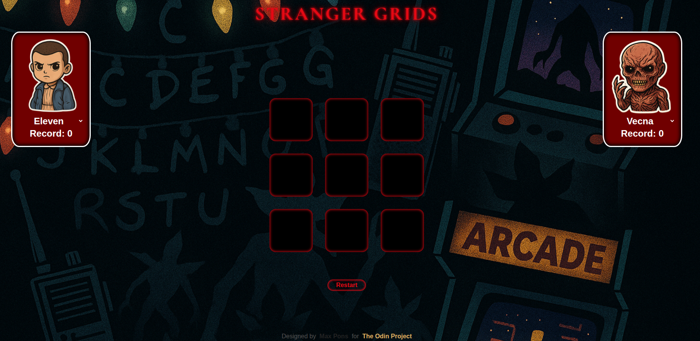

# Tic-Tac-Toe

Tic-Tac-Toe

This project was part of The Odin Project, where I worked with modular JavaScript, IIFEs, and a clean split between the DOM layer and the core game logic.

I kicked things off by building a fully working console version of the game. The mission was simple: get the logic right before even thinking about the browser. Later, when I shifted into the DOM side of things, the code started to feel like a spaghetti ritual — UI and logic tangled in ways that made my eye twitch. So I stepped back, tore out the messy wiring, and rebuilt the core mechanics into something leaner, clearer, and actually pleasant to work with.

With the foundation behaving like a civilized system, I layered the DOM back on with a much stricter boundary:
the UI only listened for player interactions and updated visuals, while the game engine handled the real decision-making.
The result ended up far cleaner, more maintainable, and nowhere near the cursed chaos it flirted with mid-development.

Future Updates

As you can probably tell, I couldn’t resist giving the interface a little personality. And with the Stranger Things finale upon us, the timing was perfect for a small tribute. I’m updating the player-name input so it becomes a selector featuring my favorite characters from the show — complete with their portraits. Stylish? Absolutely. Necessary? No. Fun? Very.